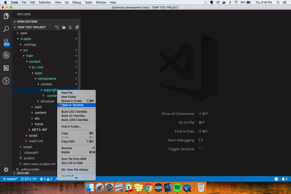

## Features

Allows you to create basic clientlib structures under any AEM component within jcr_root.

- Navigate within the jcr_root to where your components are stored (i.e. /components/content/).
- Find your desired component's folder
- Right-click on that component's to-level folder
- Choose one of three options:
    1. 'Click JS Component Clientlibs' (to build JS)
    1. 'Click CSS Component Clientlibs' (to build CSS)
    1. 'Click LESS Component Clientlibs' (to build LESS)

## Result
The entire basic structure for that component's clientlibs, respective to which one you clicked, will be built out and added under its folder hierarchy.

## Notes
- Building both CSS and LESS is possible; however the css.txt file will only be relevant to the latter of the two that you built. I will address this i
- You will need to rename the category in the .content.xml file to match your clientlibs category. The default is 'categories="[clientlib.category]"'.

## Future Releases
- Allow for you to create the category name for your .content.xml.

## Community
- Open to suggestions for what to do if you want to add CSS and LESS (or Sass if you have the compiler installed as a bundle). The thought is that you just add the folder and create another entry in the css.txt and leave it up to the developer from there.

---------------------------------------------------------------------------------------------------------------------------------------------------------
